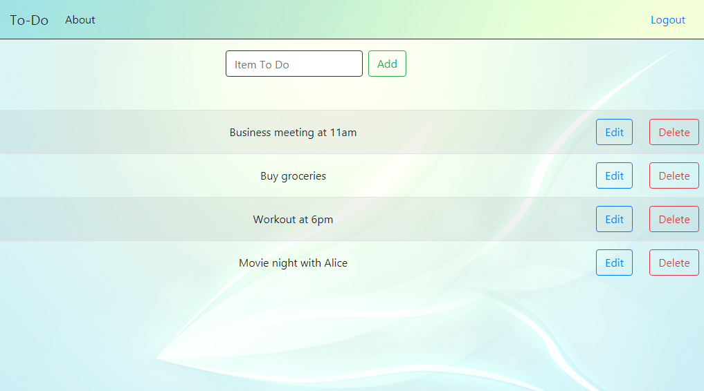

# To Do App    

* backend: Django REST framework 
* frontend: React/Redux 
* testing done with Cypress and Django testserver

# Link
[django-to-do-application.herokuapp.com](https://django-to-do-application.herokuapp.com)

# Sample Screen

